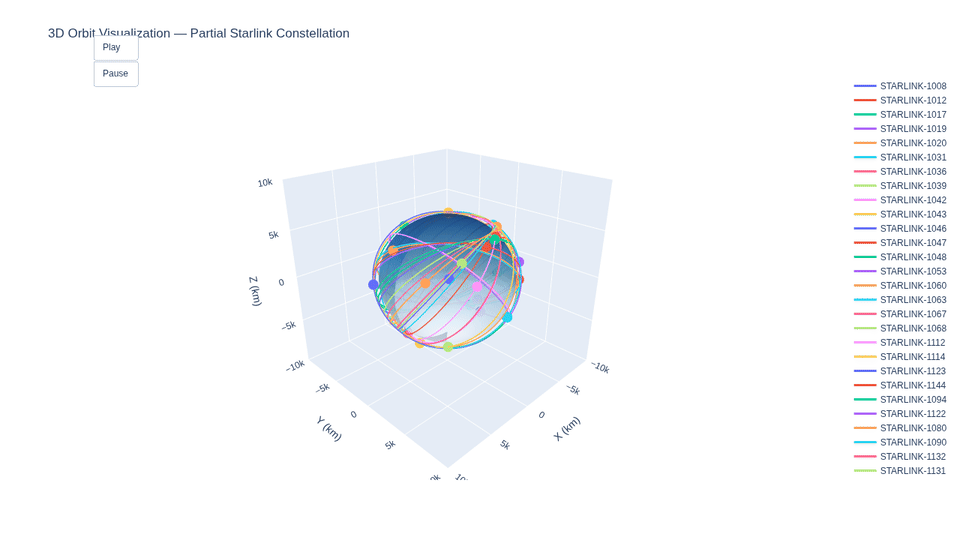
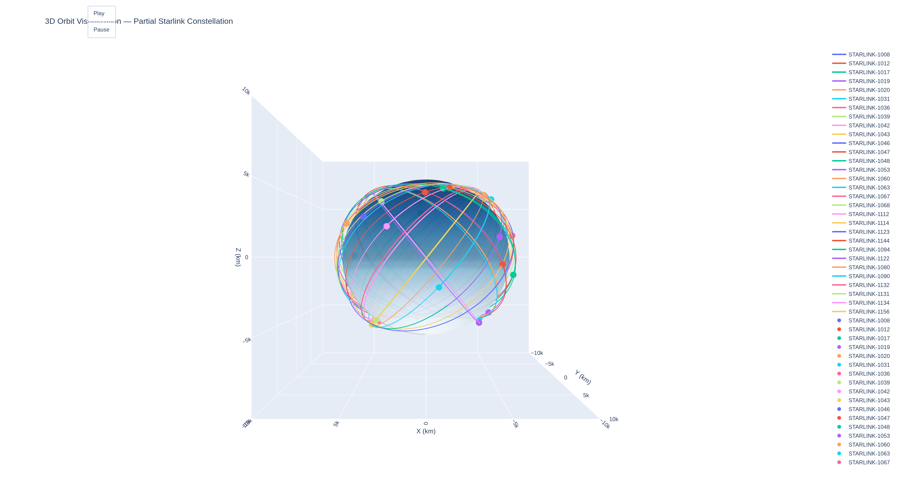
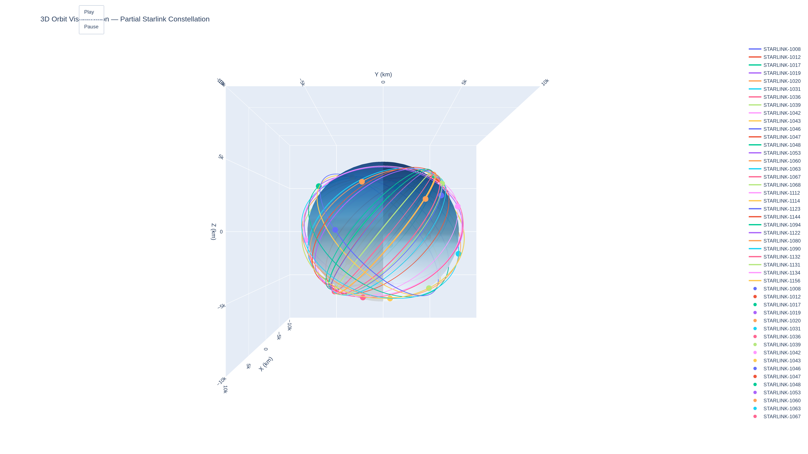
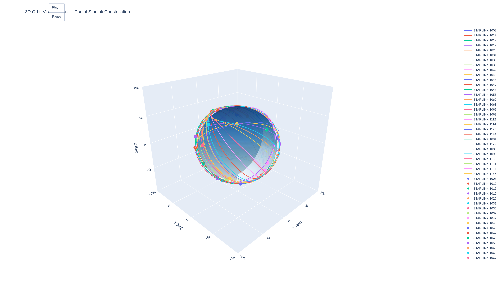

# 🛰️ Interactive 3D Satellite Orbit Visualizer

Propagates real satellite orbits from public **Celestrak TLE** data and visualizes them in an interactive **3D Plotly animation** with an Earth globe.

## 📌 Problem Statement

Space operators (e.g., **SpaceX Starlink**, **Planet**, **Rocket Lab**) require accurate 3D visualization of satellite constellations for:

- Mission planning  
- Collision avoidance  
- Operational awareness  

This project visualizes a subset of the **Starlink constellation** in real-time orbital motion using **high-precision SGP4 propagation**.

---

## 🧰 Tech Stack

- **Skyfield** – Precise orbital propagation (SGP4)
- **Plotly** – Interactive 3D visualization and animation
- **Requests + NumPy** – Data fetching and processing
- **Kaleido** – Automated static image export
- **FFmpeg** – GIF generation from animation frames

---

## 🎥 Demo

### Animated Orbit Visualization


### Static Views


**Additional perspectives:**

| Top View | Side View | Opposite View |
|--------|-----------|---------------|
|  |  |  |

🔗 **[Open Full Interactive HTML Demo](assets/starlink_3d_orbit.html)**

---

## 🚀 How to Run

### 1. Clone and Set Up Environment

```bash
git clone https://github.com/austinpaluch/satellite-3d-orbit-visualizer.git
cd satellite-3d-orbit-visualizer

python -m venv .venv
source .venv/bin/activate  # On Windows: .venv\Scripts\activate

pip install -r requirements.txt
```

### 2. Generate Visualizations

```bash
python src/visualize.py
```

---

The script will automatically:

- Fetch the latest Starlink TLE data from Celestrak
- Propagate orbits with SGP4
- Generate high-resolution static screenshots (multiple camera angles)
- Export animation frames to assets/frames/
- Save the fully interactive HTML file to assets/starlink_3d_orbit.html

---

### 3. Create the Looping GIF

# First pass: generate palette

```python
ffmpeg -i assets/frames/frame_%04d.png -vf "fps=20,scale=960:-1:flags=lanczos,palettegen" assets/palette.png
```

# Second pass: create GIF

```python
ffmpeg -i assets/frames/frame_%04d.png -i assets/palette.png -filter_complex "fps=20,scale=960:-1:flags=lanczos[x];[x][1:v]paletteuse" -loop 0 assets/orbit_animation.gif
```

(If ffmpeg is not installed: sudo apt install ffmpeg on Ubuntu/Debian, or use Homebrew/Chocolatey on macOS/Windows)

---

## 🧠 What I Learned

- Implementing the SGP4 propagator via Skyfield to handle real-world Two-Line Element (TLE) data with high precision
- Optimizing Plotly 3D scenes: static orbit traces + dynamic marker animation for smooth performance
- Automating portfolio-grade assets (multi-angle screenshots, frame exports, GIF pipeline) using Kaleido and FFmpeg
- Coordinate transformations and best practices for scientific 3D visualization in astrodynamics

---

## 🔮 Next Steps & Potential Enhancements

- Scale to full constellations (>6,000 satellites) with LOD/downsampling techniques
- Add ground track projection and real-time sensor/swath coverage footprints
- Implement basic conjunction assessment (closest approach detection)
- CLI/config file for arbitrary satellite groups (e.g., ISS, GPS, OneWeb, GEO belt)
- Textured Earth with day/night terminator and cloud layers
- Web deployment via Streamlit or Dash for live interactive demos

---

Built as part of a focused space-tech portfolio to demonstrate hands-on skills in orbital mechanics, scientific computing, and production-quality visualization.

🌟 Feel free to star the repo or open issues with ideas/suggestions!

Feedback and contributions welcome. 🚀

